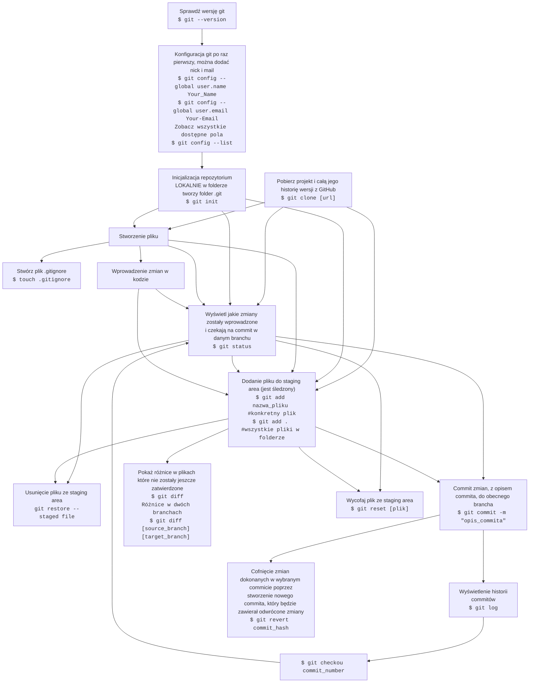
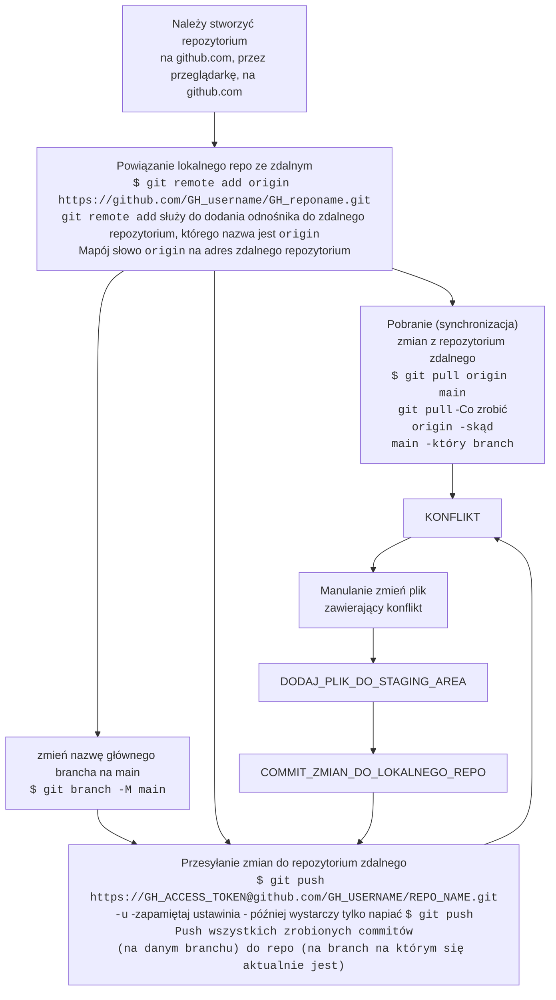
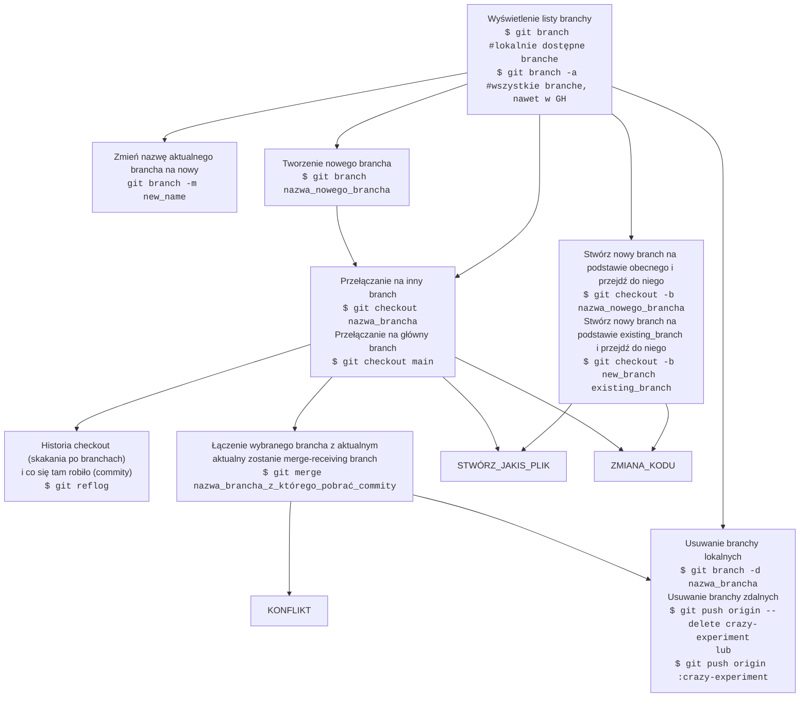

- [FULL WORKFLOW](#full-workflow)
  - [BASIC WORKFLOW](#basic-workflow)
  - [GITHUB](#github)
  - [BRANCH](#branch)
- [GITHUB ACCES\_TOKEN AND HOW TO PUSH TO GITHUB](#github-acces_token-and-how-to-push-to-github)

# FULL WORKFLOW
Git Tutorial For Dummies 

https://www.youtube.com/watch?v=mJ-qvsxPHpY

https://www.atlassian.com/git/tutorials/undoing-changes/git-reset

https://training.github.com/downloads/pl/github-git-cheat-sheet/

## BASIC WORKFLOW

## GITHUB

---
## BRANCH
<!--https://www.atlassian.com/git/tutorials/using-branches/git-merge -->

# GITHUB ACCES_TOKEN AND HOW TO PUSH TO GITHUB
1. git push using GitHub token --> Create a token in GitHub

   - Log in to GitHub and navigate to the Settings page
   - Click on Developer Settings
   - Click on Personal Access Tokens
   - Click on Generate new token
   - Skonfiguruj token

1. How to git push using GitHub token on the command line  
`$ git push https://<GITHUB_ACCESS_TOKEN>@github.com/<GITHUB_USERNAME>/<REPOSITORY_NAME>.git`

1. Automatic token authentication