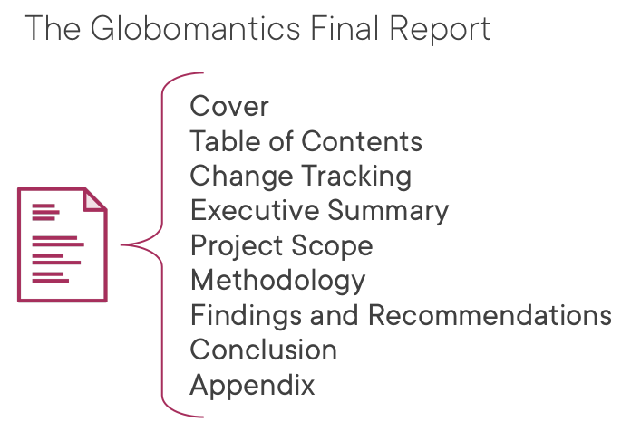
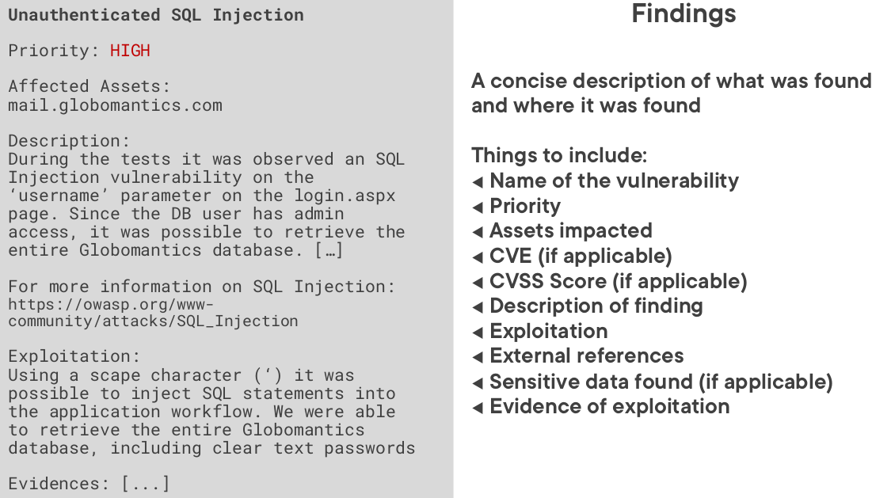
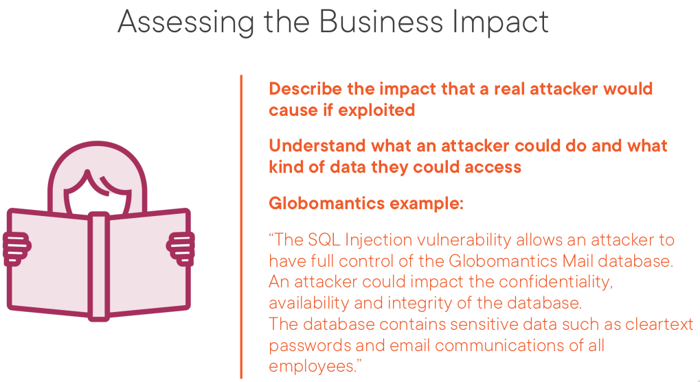
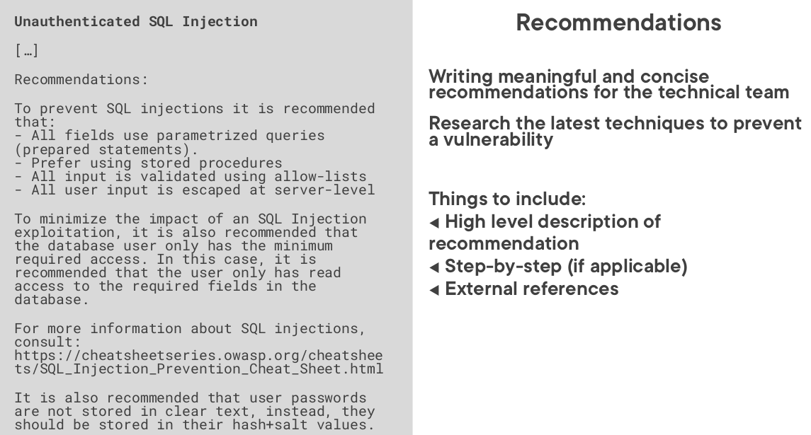
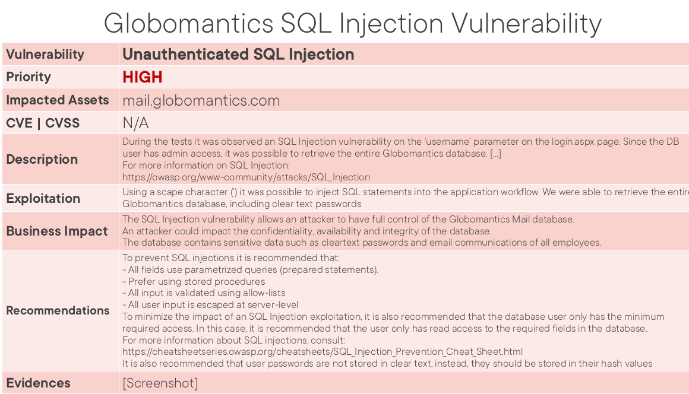
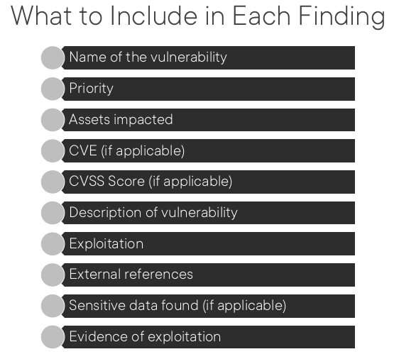

- [Reporting and Communication](#reporting-and-communication)
  - [Przykładowy układ](#przykładowy-układ)
  - [Opis znalezionej podatności (Findings and Recommendations)](#opis-znalezionej-podatności-findings-and-recommendations)
  - [Wpływ na biznes (Business Impact)](#wpływ-na-biznes-business-impact)
  - [Rekomendacje (Recommendation)](#rekomendacje-recommendation)
  - [Podsumowanie](#podsumowanie)

# Reporting and Communication
Jakie punkty powinny znaleźć się w raporcie z przeprowadzonych testów. Znaleźć templatki raportów.

## Przykładowy układ

## Opis znalezionej podatności (Findings and Recommendations)

## Wpływ na biznes (Business Impact)

## Rekomendacje (Recommendation)

## Podsumowanie

**Raport jest instrukcją jak shakować firmę, nie przesyłąć go kanałami niezaszyfrowanymi, nie udostępniać**