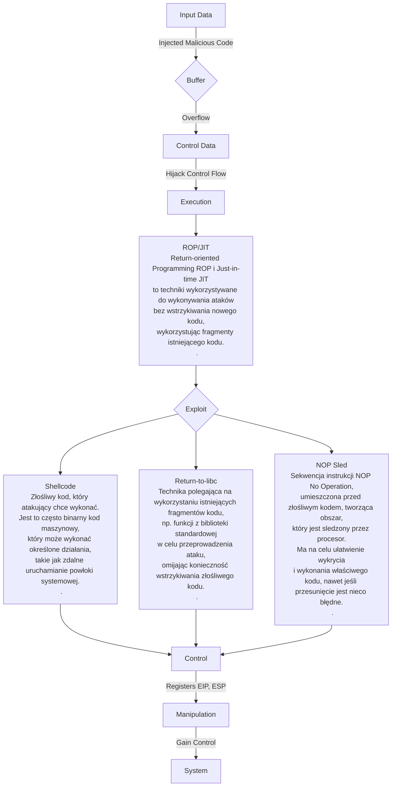
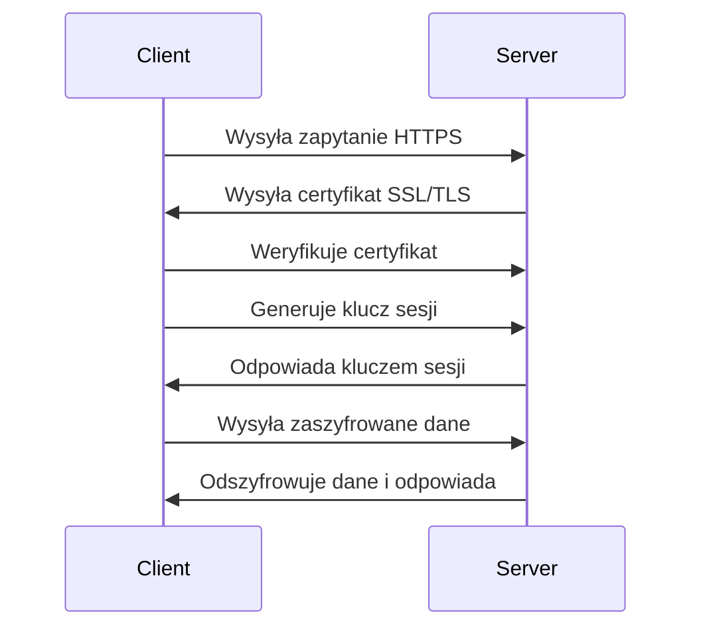

https://www.cobalt.io/blog/overflow-vulnerabilities
https://www.cobalt.io/blog/pentester-guide-to-exploiting-buffer-overflow-vulnerabilities

https://www.youtube.com/watch?v=1S0aBV-Waeo
https://www.youtube.com/watch?v=yJF0YPd8lDw&t=2863s

# Assembler

- NASM -Netwide Assembler
- MASM - Microsoft Macro Assembler

ISA (Instruction Set Architecture) - set of instructions to understand and use to write a program: memory, registry, instructions, ...
most common ISA: x86 (32 bit), x64 (64 bit) (długość rejestru)

# Memory Regions

https://www.youtube.com/watch?v=jKcg3ze10Hk
![[Pasted image 20231204142143.png]]

## Stack vs Heap

[[Stos (stack) i sterta (heap)]]
https://www.youtube.com/watch?v=5OJRqkYbK-4

# Działanie programu w Assemblerze

[[ASSEMBLER_program]]

# Useful Registers in Assembly

Rxx - 64-bit Registers -
Exx - 32-bit Registers:

- https://www.eecg.toronto.edu/~amza/www.mindsec.com/files/x86regs.html
- https://medium.com/@sharonlin/useful-registers-in-assembly-d9a9da22cdd9

## EBP

base pointer for the current stack frame. When a function is called, some space is reserved on the stack for local variables, which is referenced as EBP.

## EIP

instruction pointer - przechowuje adres następnej instrukcji do wykonania przez procesor

## ESP

stack pointer - pokazuje wolny adres na stosie gotowy do zapisania w nim danych, po zapisaniu w tym miejscu danych jest inkrementowany tak aby wskazywał kolejny wolny adres

## ESI

Source index for string operations. Essentially, this stores the start of the string that you’re saving to memory and is also used for string/memory copying.

## RET

kończy wykonanie procedury i nakazuje powrót do program wywołującego

# ASLR (Address space layout randomization)

[Address space layout randomization](https://en.wikipedia.org/wiki/Address_space_layout_randomization)

## Bypas

### Bruteforce

### NOP-Sled

# DEP (Data Execution Prevention)

celem jest uniemożliwienie wykonywania kodu z segmentu danych. Pomaga to w ochronie przed exploitami wykorzystującymi przepełnienie bufora.

# Programy

## Immunity Debugger - debugging binaries.

mona plugin - https://github.com/corelan/mona

```powershell
# na dole w polu komend Immunity Debugger
!mona config -set workingfolder C:\ImmunityLogs\%p #configure working folder

# mona create payload
!mona pc 100 # payload ze 100 znakami

# mona find correct offset
!mona po xxxxx # x wartośc z EIP

# auto generate msf module
!mona suggest

!mona jmp -r esp
# -r register we want to target

!mona modules # sprawdź ASLR status
!mona noaslr # pokaż moduły bez włączonego ASLR
```

## IDA Pro

## Metasploit

pattern_create
./pattern_create.rb 100
pattern_offset
./pattern_offset.rb 22

## EMET

## Proces Explorer

https://learn.microsoft.com/pl-pl/sysinternals/downloads/process-explorer

# Real world BOF

#TODO

# Exploiting Buffer Overflows

https://www.ired.team/offensive-security/code-injection-process-injection/binary-exploitation
Atak buffer overflow na stosie można przeprowadzić w następujący sposób:

1. **Nadmiar danych**: Atakujący wprowadza do bufora więcej danych, niż jest on w stanie pomieścić.
2. **Nadpisanie danych na stosie**: Nadmiarowe dane zaczynają być zapisywane poza zaalokowanym buforem, co może prowadzić do nadpisania zmiennych na stosie, w tym adresu powrotu.
3. **Nadpisanie adresu powrotu**: Atakujący umieszcza w nadmiarowych danych złośliwy kod (zwany exploitem) i zmienia adres powrotu (EIP) na adres, w którym znajduje się ten złośliwy kod.
4. **Wykonanie złośliwego kodu**: Gdy funkcja kończy swoje wykonywanie i próbuje powrócić do miejsca, z którego została wywołana, procesor wykonuje złośliwy kod umieszczony przez atakującego, który jest teraz wskazywany przez adres powrotu (EIP).
   Which register value will help us to determine the required bytes of data before overriding the EIP register? - EIP

## NULL-free shellcode

shellcode nie może zawierać `\x00` (NULL) - kopiowanie ciągów string tylko do tego znaku, wszystko co po nim nie zostanie skopiowane do bufora

- NULL-free encoding
- Alphanumeric and printable encoding
- Self-modyfying Code
  ![[Pasted image 20231208105703.png]]

## Debugging Shellcode

Program pozwalający na sprawdzanie działania shellcode

1. Zamienić `"shell code will go here!"` na własny shellcode
2. Skompilować
3. Uruchomić, jeśli shellcode wykona sie jak zaplanowano to działa dobrze

```C
char code[] = "shell code will go here!";
int main(int argc, char **arqgv)
{
	int (*func) ();
	func = (int (*)()) code;
	(int) (*func) ();
)
```

np:

```C
# ma uruchomić calc.exe
char code[] =
"\x31\xdb\x64\x8b\x7b\x30\x8b\x7f"
"\x0c\x8b\x7f\x1c\x8b\x47\x08\x8b"
"\x77\x20\x8b\x3f\x80\x7e\x0c\x33"
"\x75\xf2\x89\xc7\x03\x78\x3c\x8b"
"\x57\x78\x01\xc2\x8b\x7a\x20\x01"
"\xc7\x89\xdd\x8b\x34\xaf\x01\xc6"
"\x45\x81\x3e\x43\x72\x65\x61\x75"
"\xf2\x81\x7e\x08\x6F\x63\x65\x73"
"\x75\xe9\x8b\x7a\x24\x01\xc7\x66"
"\x8b\x2c\x6f\x8b\x7a\x1c\x01\xc7"
"\x8b\x7c\xaf\xfc\x01\xc7\x89\xd9"
"\xb1\xff\x53\xe2\xfd\x68\x63\x61"
"\x6C\x63\x89\xe2\x52\x52\x53\x53"
"\x53\x53\x53\x53\x52\x53\xff\xd7"

int main...
```

## Manual shellcode generation

https://www.vividmachines.com/shellcode/shellcode.html

### Pisząc Assemblera

Stworzenie kodu, który uśpi procesor na 5 sekund

1. Zlokalizować adres funkcji sleep w Kernel32.dll, za pomoca deassemblera lub programu `arwin.exe`
1. Napisać program w Assemblerze usypiający procesor na 5 sekund
   ```Assembly
   xor eax, eax                   ; zero out the eax register
   mov eax, 5000                  ; move the milliseconds value into eax (5000)
   push eax;                      ; push the function parameter onto the stack ; move the address of Sleep into ebx call the function
   mov ebx, Ox757d82d0 call ebx   ; move the address of Sleep into ebx call the function - Sleep (ms);
   ```
   Please note that we can create many different versions of the same code. For example, we can push 5000 directly onto the stack, without zeroing out the EAX register, and save one line of code.
1. Skompilować kod ASM
   `nasm -f win32 sleep.asm-O sleep.obj`
1. Zrobić dump stworzonego pliku `sleep.obj`, potrzeby bytecode stworzonego programu
   `objdump -d -Mintel sleep.obj`
1. Usunąć spacje i dodać prefix `\x`
   ![[Pasted image 20231208115110.png]]
   ```C
   # po skompilowaniu i uruchomieniu
   char code[] =
   "\x31\xc0"
   "\xb8\x88\x13\x00\x00"
   "\x50"
   "\xbb\xd0\x82\x7d\x75"
   "\xff\xd3";
   int main(int argc, char **argv)
   {
   	int (*func)();
   	func (int (*)()) code; (int) (*func)();
   }
   ```
   Jeśli ASLR jest włączony to adres instrukcji sleep jest losowy, każdy OS ma też inny adres.

### Pisząc w C++

1. Napisać program w C++
   ```C
   #include <windows.h>
   int main(int argc, char** argv)
   {
   	ShellExecute (0,"open", "cmd", NULL, 0, SW_MAXIMIZE);
   }
   ```
1. Skompilować go
   ![[Pasted image 20231208122950.png]]
1. Wyciągnąć Shellcode
1. ...

# Buffer Overflow Graf



# Crypto
![[Crypto]]

# Public Key Infrastructure
![[Public_Key_Infrastructure]]



