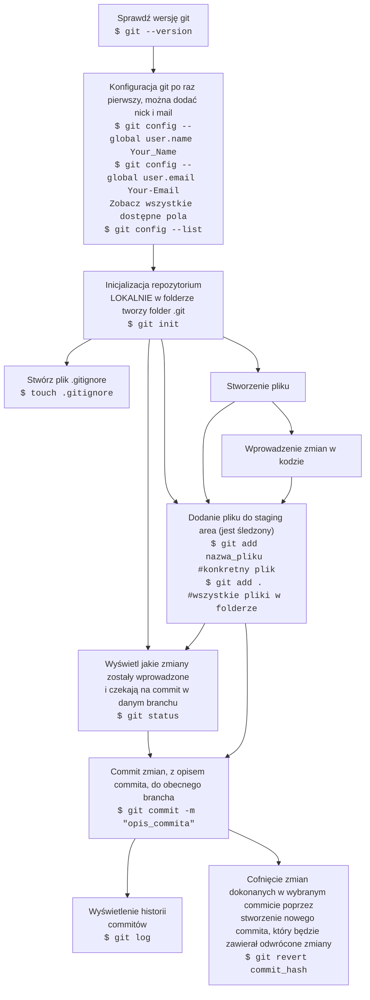
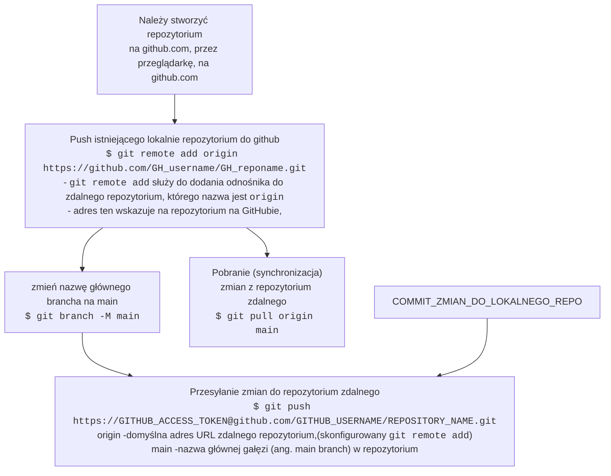
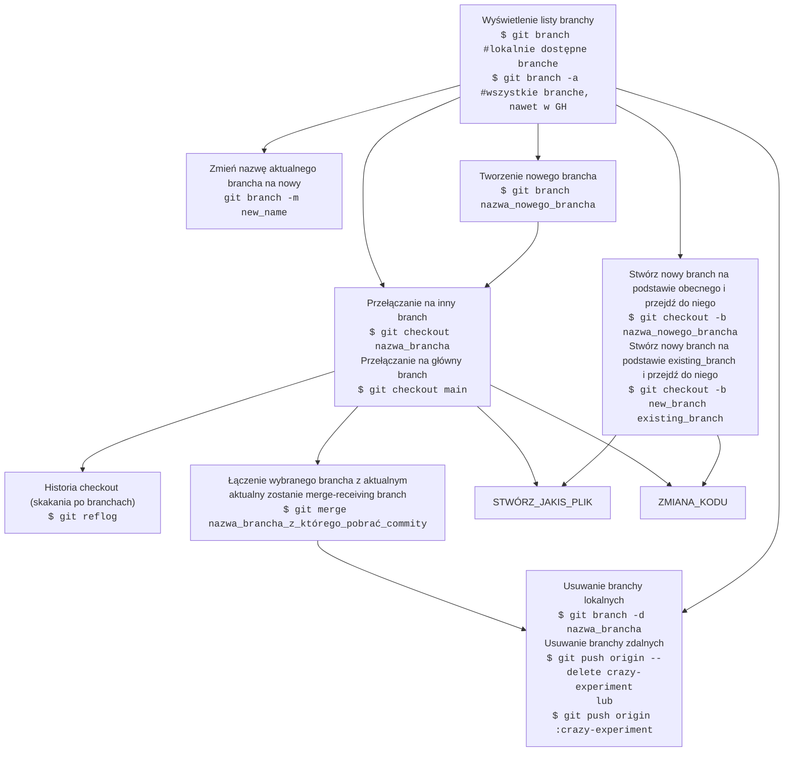

# FULL WORKFLOW
## BASIC WORKFLOW

## GITHUB

        ZMIANA_KODU --> SPRAWDZ_ZMIANY_W_REPO
        SPRAWDZ_ZMIANY_W_REPO-->STWÓRZ_JAKIS_PLIK
---
## BRANCH

    
# BASIC WORKFLOW
# BRANCHES
<!--https://www.atlassian.com/git/tutorials/using-branches/git-merge -->
# GITHUB

# GITHUB ACCES_TOKEN AND HOW TO PUSH TO GITHUB
1. git push using GitHub token --> Create a token in GitHub

   - Log in to GitHub and navigate to the Settings page
   - Click on Developer Settings
   - Click on Personal Access Tokens
   - Click on Generate new token
   - Skonfiguruj token

2. How to git push using GitHub token on the command line  
`$ git push https://<GITHUB_ACCESS_TOKEN>@github.com/<GITHUB_USERNAME>/<REPOSITORY_NAME>.git`

1. Automatic token authentication