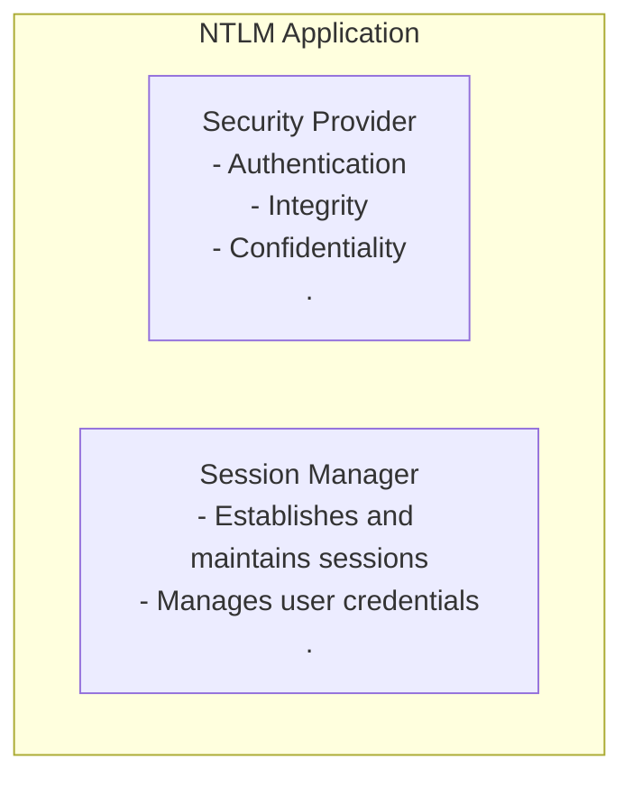
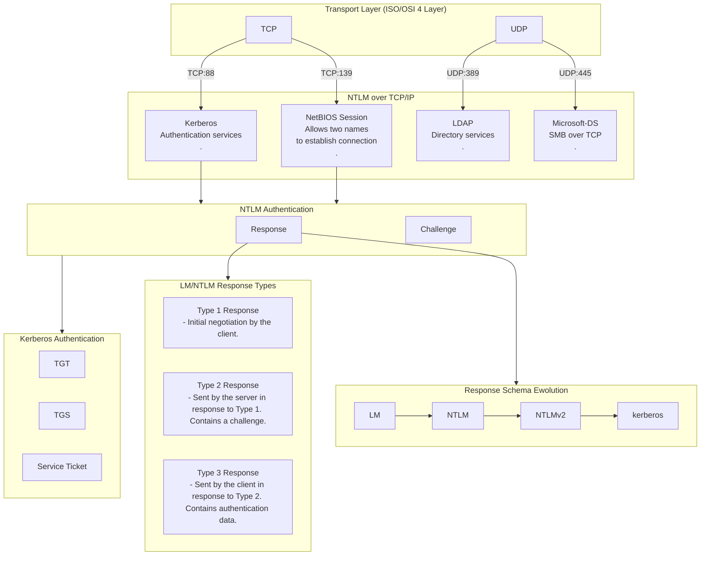

NTLM (U:389,445, T:139, 88)
NT LAN Manager
U:389 - LDAP services
U:445 - Microsoft-DS services (SMB over TCP)
T:139 - NetBIOS Session services
T:88 - Kerberos services

Protokół NTLM obejmuje usługi autentykacyjne (Challenge-Response), które są używane do uwierzytelniania użytkowników w środowiskach Windows. 
NTLM może być używany razem z innymi usługami, takimi jak:
* LDAP (do dostępu do katalogu), NetBIOS Session (do komunikacji na poziomie sesji), 
* SMB over TCP (do udostępniania plików i drukarek)
* Kerberos (do bardziej zaawansowanych usług bezpieczeństwa). 
NTLM zapewnia mechanizmy bezpieczeństwa, takie jak uwierzytelnianie użytkowników, integralność danych i poufność.

is used either when the client is authenticating to a server using an IP address or, when the client is authenticating to a server that does not belong to the same domain

NTLM authentication is a challenge/response protocol and consists of three messages:
* Type 1 (negotiation), 
* Type 2 (challenge),
* Type 3 (authentication).

NTLM response is sent together with the LM response, most of the time .