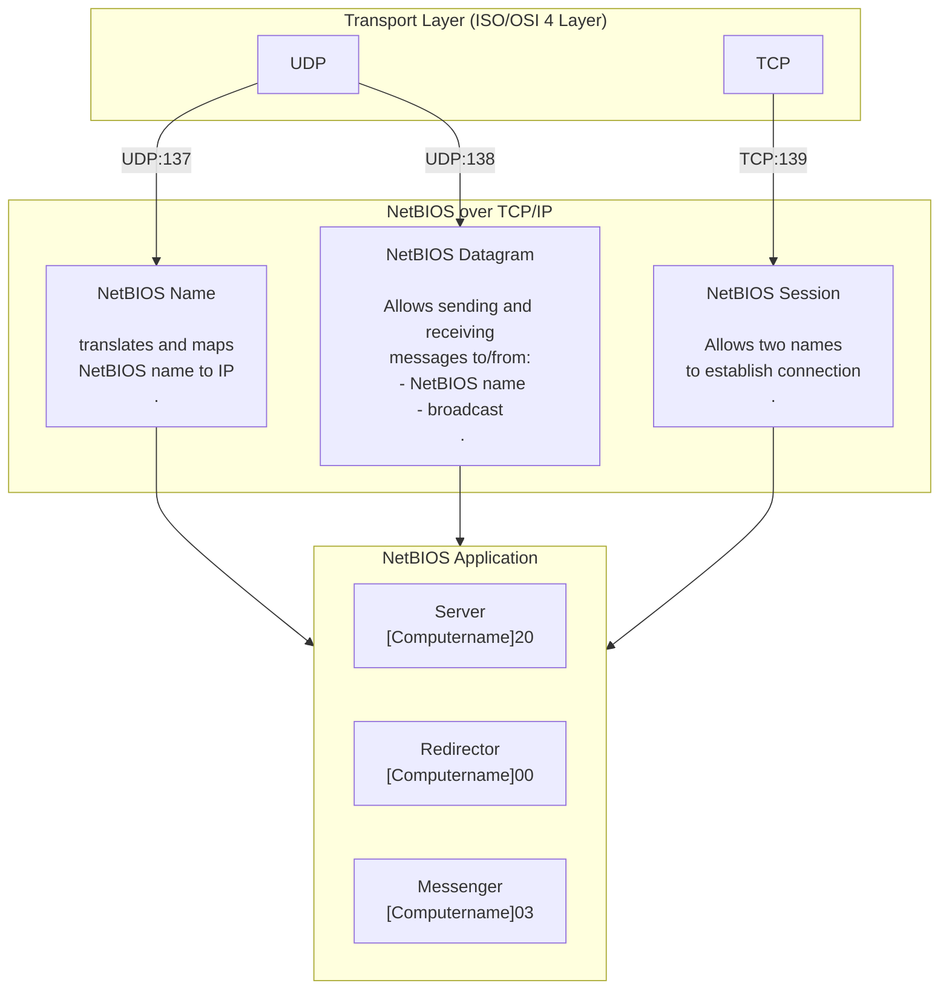

Network Basic Input / Output System
U:137 - name services
U:138 - datagram services
T:139 - session services

```mermaid
graph TD
    subgraph _ [Transport Layer &lpar;ISO/OSI 4 Layer&rpar;]
        TCP
        UDP
    end
    subgraph NetBIOS over TCP/IP
        TCP -->|TCP:139| NetBIOS_Session[NetBIOS Session<br><br>Allows two names<br>to establish connection<br> .] 
        UDP -->|UDP:137| NetBIOS_Name[NetBIOS Name<br><br>translates and maps<br>NetBIOS name to IP<br> .]
        UDP -->|UDP:138| NetBIOS_Datagram[NetBIOS Datagram<br><br>Allows sending and receiving<br>messages to/from:<br> - NetBIOS name<br>- broadcast<br> .]
    end
    NetBIOS_Name --> NetBIOS_Application
    NetBIOS_Datagram --> NetBIOS_Application
    NetBIOS_Session --> NetBIOS_Application
    subgraph NetBIOS_Application [NetBIOS Application]
        Server[Server<br>&lbrack;Computername&rbrack;20]
        Redirector[Redirector<br>&lbrack;Computername&rbrack;00]
        Messenger[Messenger<br>&lbrack;Computername&rbrack;03]
    end
```