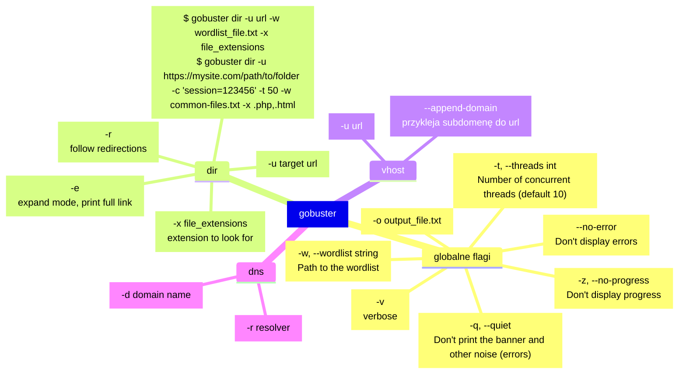

# gobuster

```mermaid
mindmap
  root[gobuster]
    globalne flagi
      ["-t, --threads int<br>Number of concurrent threads (default 10)"]
      ["-w, --wordlist string<br>Path to the wordlist"]
      ["--no-error<br>Don't display errors"]
      ["-z, --no-progress<br>Don't display progress"]
      ["-v<br>verbose"]
      ["-q, --quiet<br>Don't print the banner and other noise (errors)"]
      ["-o output_file.txt"]

    dir
      ["$ gobuster dir -u url -w wordlist_file.txt -x file_extensions<br>$ gobuster dir -u https://mysite.com/path/to/folder -c 'session=123456' -t 50 -w common-files.txt -x .php,.html"]
      ["-u target url"]
      ["-x file_extensions<br>extension to look for"]
      ["-e<br>expand mode, print full link"]
      ["-r<br>follow redirections"]
    vhost
      ["-u url"]
      ["--append-domain<br>przykleja subdomenę do url"]
    dns
      ["-d domain name"]
      ["-r resolver"]

```

