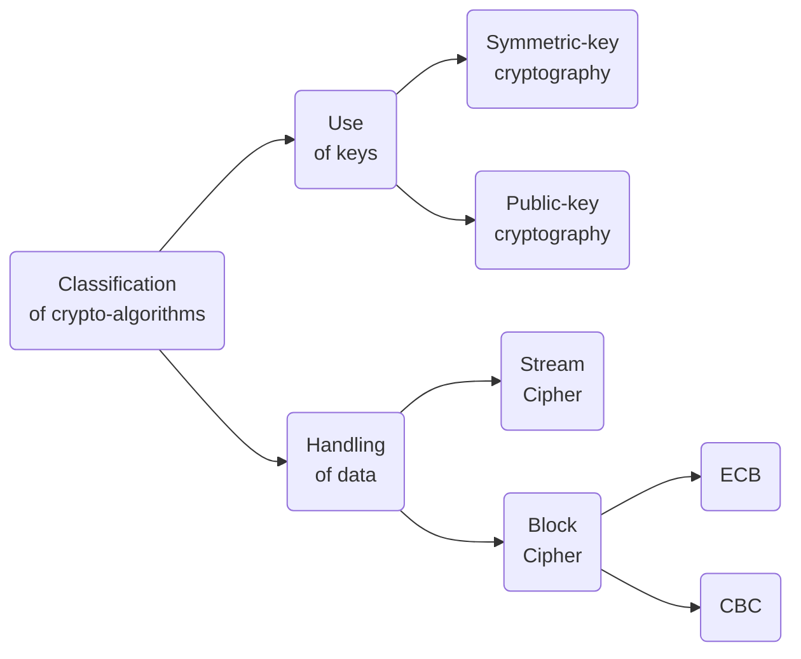

| **Based on how the keys are used**        |                                                                                                                                                                                                                                  |
| ----------------------------------------- | -------------------------------------------------------------------------------------------------------------------------------------------------------------------------------------------------------------------------------- |
| Symmetric-key cryptography             | Both the sender and receiver share the same key.   DES(Data Encryption Standard) / 3DES, AES(Advanced Encryption Standard), RC4, Blowfish, ...                                                                                |
| Public-key cryptography                | There are two keys for each peer.  A public key, freely distributed. A private key which is to be kept secret. The public key is typically used for encryption, while the private or secret key is used for decryption. |
| **Based on how the plaintext is handled** |                                                                                                                                                                                                                                  |
| Block Cipher                              | they handle data in blocks (say chunks of 8 bytes or 16 bytes), e.g. DES, AES + ECB (Electronic Code Book) + CBC (Cipher Block Chaining)                                                                                   |
| Stream Cipher                             | Data is handled one byte at a time, e.g. RC4, A5/1                                                                                                                                                                               |

In the ECB (Electronic Code Book) mode, the message is divided into blocks and each block is encrypted separately.
![[Pasted image 20231218093240.png]]
In the Cipher-block chaining (CBC) mode, each ciphertext block is derived from the previous blocks as well.
![[Pasted image 20231218093302.png]]
