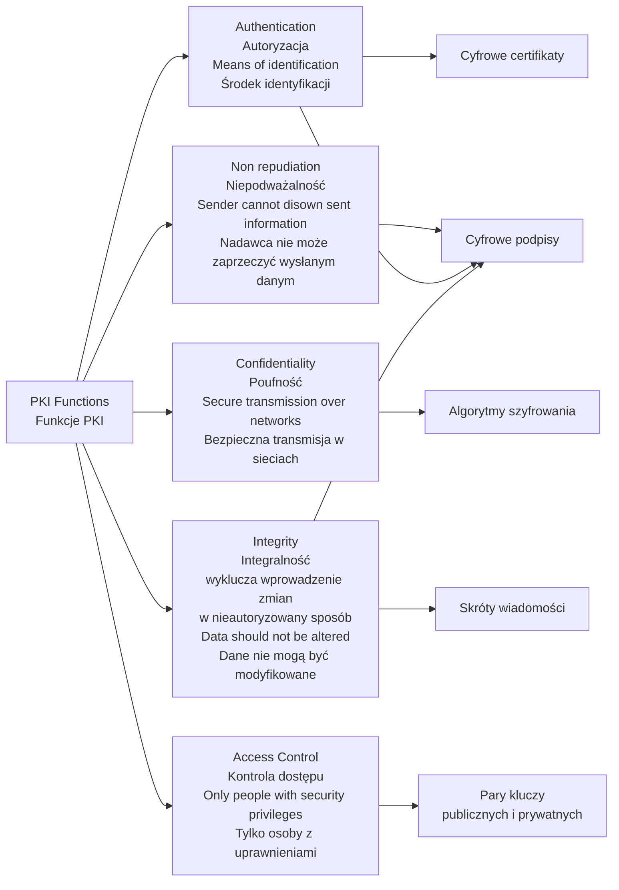
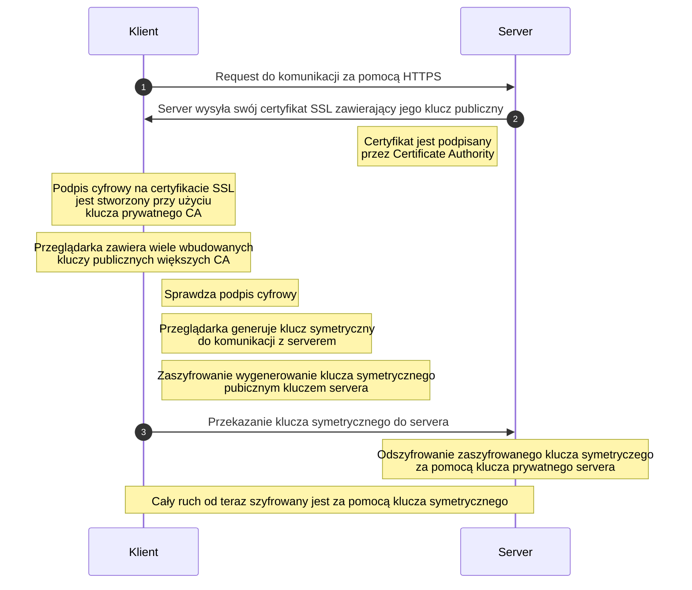
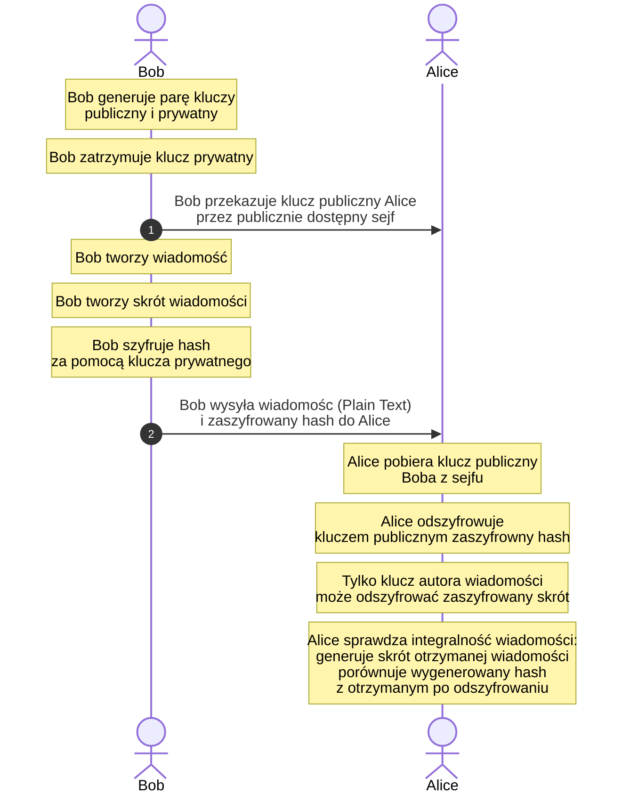
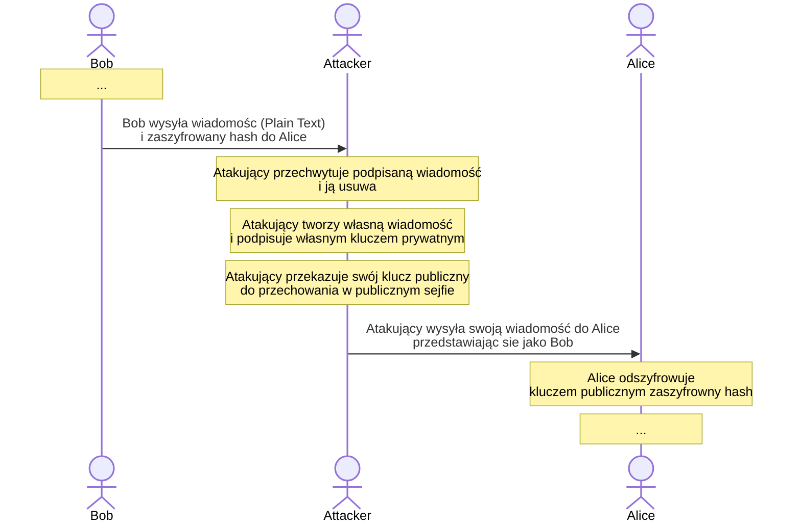
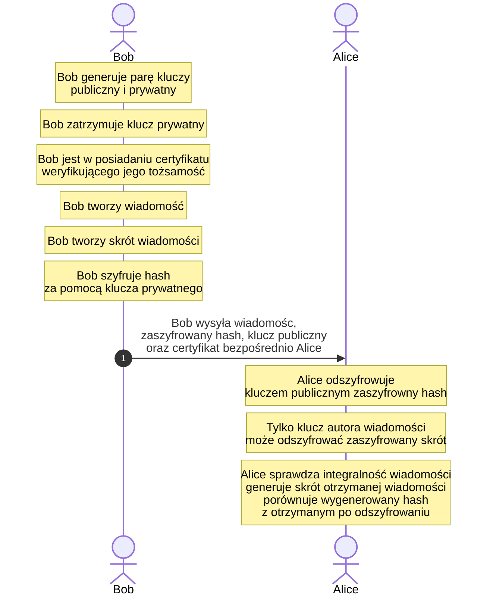

# Public Key Infrastructure 
Dobrze wytłumaczone: https://www.youtube.com/playlist?list=PLSNNzog5eyduzyJ8_6Je-tYOgMHvo344c

[Idiot guide dla PKI](https://www.giac.org/paper/gsec/2171/idiots-guide-public-key-infrastructure/103692)
[crashcourse PKI](https://www.nexusgroup.com/crash-course-pki/)

Public Key Infrastructure (PKI) to zbiór sprzętu, oprogramowania, ludzi, zasad i procedur niezbędnych do tworzenia, zarządzania, przechowywania, dystrybucji i unieważniania cyfrowych certyfikatów.

- X.509 is the standard for public key certificates.
- X.509 certificates are widely used in protocols like SSL/TLS, SET, S/MIME, IPsec and more.

---

**Działanie Certificate Authority (CA)**
Certificate authorities are one of the integral parts that make up a larger system called PKI (public key infrastructure)
Distributed trust model https://www.youtube.com/watch?v=LPxeYtMDxl0
The certificate can be used to verify that a public key belongs to an individual.
A certificate binds a public key with an identity by means of digital signature.
Certificate Authorities Are Like Passport Authorities for the Internet

---

W kryptografii, PKI opiera się na kilku elementach, aby upewnić się, że tożsamość osoby lub organizacji jest skutecznie potwierdzona i zweryfikowana za pomocą Certificate Authority (CA). Tożsamość użytkownika musi być unikalna dla każdego CA. Sam CA oferuje usługę zapewnienia pewności co do autentyczności.

Oto podstawowe kroki, które opisują sposób działania PKI:

1. **Generowanie kluczy:** Każdy użytkownik PKI otrzymuje parę kluczy: publiczny i prywatny. Klucz publiczny jest udostępniany publicznie, a klucz prywatny jest przechowywany poufnie przez użytkownika.
2. **Tworzenie certyfikatów:** Użytkownik, chcąc udowodnić swoją tożsamość, prosi o certyfikat od Certyfikującego Organu (CA). CA weryfikuje tożsamość użytkownika i tworzy cyfrowy certyfikat zawierający klucz publiczny użytkownika, jego dane i podpis cyfrowy CA.
3. **Rozpowszechnianie certyfikatów:** Certyfikaty są rozpowszechniane w celu używania ich przez inne osoby lub systemy w celu potwierdzenia tożsamości danego użytkownika. Te certyfikaty są przesyłane i przechowywane w zaufanych miejscach, takich jak serwery, przeglądarki internetowe, itp.
4. **Weryfikacja:** Kiedy ktoś chce sprawdzić czyjaś tożsamość w PKI, używa klucza publicznego z certyfikatu. Jeśli podpis w certyfikacie można zweryfikować za pomocą klucza publicznego CA, tożsamość jest uznawana za wiarygodną.
5. **Unieważnianie:** Jeśli klucz prywatny zostanie skompromitowany lub certyfikat straci ważność, CA może unieważnić certyfikat, informując o tym wszystkie systemy, które go posiadają.

# Funkcje PKI

# Certyfikat SSL

https://www.youtube.com/watch?v=33VYnE7Bzpk

Certyfikat SSL to certyfikat danego serwera web, przyznany przez CA. Weryfikuje tożsamość i jego klucz publiczny.

![[Pasted image 20240103095805.png]]

# Digital Signature (Cyfrowy Podpis)

https://www.youtube.com/watch?v=TmA2QWSLSPg
Elektroniczna weryfikacja wysyłającego.
Używa asymetrycznej kryptografii.

![[Pasted image 20240103095927.png]]
## Atak MitM

Lack of Authentication
W ataku MitM, atakujący może udawać zarówno nadawcę, jak i odbiorcę. Atakujący może podać swój własny klucz publiczny jako zastępczy dla prawdziwego klucza odbiorcy i użyć własnego klucza prywatnego do podpisania fałszywego dokumentu.

# Digital Certificate

https://www.youtube.com/watch?v=UbMlPIgzTxc  
https://help.webex.com/pl-pl/article/WBX42278/Czym-jest-certyfikat-cyfrowy-X.509
Creating a rogue CA certificate - http://www.win.tue.nl/hashclash/rogue-ca/
Certyfikaty cyfrowe (Digital Certificates) to elektroniczne dane uwierzytelniające:

- wydawane przez zaufaną trzecią stronę
- weryfikuje tożsamość właściciela
- sprawdza, czy właściciel jest właścicielem klucza publicznego

Zapobiega podszywaniu się przy użyciu podpisu cyfrowego [[Public_Key_Infrastructure#Atak MitM]].
Bazuje na zaufaniu do wystawiającego certyfikat (Certification Authority)

![[Pasted image 20240103095619.png]]